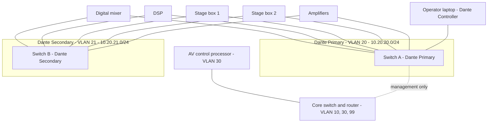

# Conceptual Dante/AoIP Network Design (Not Deployed)

> **CONCEPTUAL DESIGN ONLY.** I designed this on paper as a learning exercise. It was **never built, configured, or tested** on real equipment. Device names, VLAN IDs, and addresses are invented. Vendor settings vary, so a real deployment must follow the manufacturers' current documentation.
>
> **View the rendered diagram on GitHub:** [dante-aoip-design.md on GitHub](https://github.com/qlavelle/qlavelle.github.io/blob/main/projects/dante-aoip-design.md). The Pages site shows the diagram as code.

## Scenario (fictional)

A small training room with a mixer, DSP, two stage boxes, amplifiers, an operator laptop, and an AV control processor. Audio must stay independent of the office network.

## Diagram (Mermaid)

## VLAN and subnet plan (assumed)

| VLAN | Purpose | Subnet | Notes |
|---|---|---|---|
| 10 | Office data | 10.10.10.0/24 | No Dante devices |
| 20 | Dante Primary | 10.20.20.0/24 | Audio, clock, discovery |
| 21 | Dante Secondary | 10.20.21.0/24 | Separate switch, redundant path |
| 30 | AV control | 10.30.30.0/24 | Control processor, touch panels |
| 99 | Switch management | 10.99.99.0/24 | Admin access only |

Subnets don't overlap (checked with Python). Each has 254 usable hosts, far more than this room needs.

## Traffic flows

- **Clock (PTP):** one clock leader is elected per subnet and multicasts timing to followers. Dante uses PTP v1 by default and doesn't need PTP-aware switches. [31] PTP uses 224.0.1.129 to 224.0.1.132 on UDP ports 319 and 320. [43]
- **Audio:** flows as unicast for small fan-out. Multicast audio uses UDP 4321, and unicast audio uses a port range of about 14336 to 14600. [43]
- **Discovery/control:** Dante Controller sits on the same subnet as the devices to discover them. I am assuming this from general Dante practice. Confirm it in Audinate's documentation.
- **QoS priorities:** PTP events use DSCP 56 (CS7), audio and PTPv2 use DSCP 46 (EF), and low-priority reserved traffic uses DSCP 8 (CS1). QoS is required only on 100 Mbps or mixed-speed networks, though it is recommended on mixed-use networks. It must use strict priority. [31]
- **Multicast:** if multicast is used, enable IGMP snooping with a querier. [32]

## Configuration assumptions

- All-gigabit managed switches with QoS trust set to DSCP and strict-priority queues.
- IGMP snooping and a single querier per audio VLAN only if multicast flows are used.
- Primary and Secondary networks share no switches.
- The core switch carries only management and control traffic between VLANs, and Dante audio never crosses into the office VLAN.
- Firewall rules, IP addressing method (static or DHCP), and per-vendor menus are not specified.

## Limits

- Not built, tested, or measured. No latency or capacity claims.
- I have not configured any switch or Dante device.
